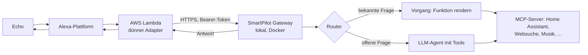

# SmartPilot

**Deine Alexa mit Superkräften.** Ein privat betriebener, deutscher
Sprachassistent: Amazon Echo fragt, dein eigener Server antwortet — schnell,
wo es zählt, und klug, wo es drauf ankommt.

## Warum es SmartPilot gibt

Zwei Wege führten nach Alexa — jeder mit einem Haken. Die kostenlose
Alexa-Anbindung von Home Assistant (die kleine Schwester des
Nabu-Casa-Cloud-Dienstes) ist blitzschnell: „Alexa, schalte das Licht aus" —
und das Licht ist aus, ohne Skill-Namen, ohne Wartezeit. Aber sie kennt nur
Befehle. Fragen wie „Ist noch jemand wach?" bleiben offen.
[HomeAssistantAssistAWS](https://github.com/fabianosan/HomeAssistantAssistAWS)
ist das Gegenteil: ein Universalschraubenschlüssel, der jede Frage über die
Assist-Conversation-API und ein LLM beantwortet — dafür mit jeder Antwort
eine Wartezeit.

SmartPilot ist die Antwort auf die Frage: Warum nicht beides? Ein Router
entscheidet pro Frage, ob der schnelle feste Weg genügt oder ob der Agent
mit Werkzeugen ran muss. Und weil ein Zuhause mehr ist als Home Assistant,
kann SmartPilot alles anzapfen, was MCP, HTTP oder eine Shell anbietet —
Websuche, Musik, Verkehr, eigene Dienste. Neue Funktionen kommen als
Installationspakete hinzu: Parameter eingeben, fertig. Kurz: ein
Universalschlüssel für Alexa — für alles, was eine API, einen MCP-Server
oder eine Shell hat.

Ein ehrliches Wort: SmartPilot ist ein Custom Skill. Alexa braucht daher den
Skill-Namen — „Alexa, sage SmartPilot, schalte das Licht aus". Die native
Anbindung ohne Skill-Namen ist als späterer Ausbau denkbar, bei entsprechendem Wunsch der Community.

Derzeit ist der Skill nur in deutsch ausgeprägt, daher auch nur deutsche Dokumentation. Bei entsprechendem Bedarf aus der Community wäre eine Multisprachlösung aber möglich. 

## Was SmartPilot ausmacht

- **Schnell, wo es zählt.** Klare, wiederkehrende Fragen — „Hausstatus",
  „Wetter", „Ist jemand zuhause?" — beantwortet ein fester Router
  deterministisch: gleiche Frage, gleiche Antwort, in Sekundenbruchteilen.
  Keine KI-Lotterie.
- **Beides, wenn es passt.** Im Hybrid-Modus holt eine Funktion die Daten
  fest und verlässlich — das LLM formuliert daraus nur den Satz. Zahlen
  bleiben Zahlen, die Sprache bleibt natürlich.
- **Klug, wo es drauf ankommt.** Alles Offene übernimmt ein LLM mit
  Werkzeugaufrufen — mit Kurzzeitgedächtnis für Folgefragen und Rückfragen bei
  Mehrdeutigkeit.
- **Im Gespräch bleiben.** Der Agent stellt Rückfragen bei Mehrdeutigkeit —
  der Kanal bleibt dann offen. Dass Antworten zum Nachfragen einladen (etwa
  nach Listen oder Berichten), lässt sich zusätzlich per Einstellung
  aktivieren. Mit „starte Chat-Modus" wird daraus ein richtiges Gespräch —
  „chat beenden" schließt es wieder.
- **Eingebunden, nicht eingebildet.** Über MCP greift SmartPilot auf deine
  echte Welt zu: Smart Home, Websuche, Musik, Verkehr.
- **Privat & lokal.** Die Intelligenz läuft auf deiner eigenen Hardware. Deine
  Fragen bleiben bei dir.

## Wie es funktioniert



Zwei Wege, ein Flow: Der **Router** erkennt konfigurierte Vorgänge und
beantwortet sie ohne LLM (deterministisch) oder mit reiner Formulierung
(hybrid); LLM-Vorgänge nutzen denselben Agenten mit eigenem Prompt. Alles
andere übernimmt der **Agent** — ein LLM, das selbst entscheidet,
welche Werkzeuge und Funktionen es braucht. Standard ist der
**OneShot-Modus** (eine Frage, eine Antwort); mit „Chat-Modus" bleibt die
Session für Folgefragen offen, und Rückfragen des Agenten bei Mehrdeutigkeit
öffnen sie ebenfalls.

Details: [doc/CONCEPTS.md](doc/CONCEPTS.md) ·
[doc/ARCHITECTURE.md](doc/ARCHITECTURE.md)

## Schnellstart

Voraussetzungen: Docker mit Compose-Plugin und eine OpenAI-kompatible
LLM-Schnittstelle (mit Tool-Calling).

```bash
git clone https://github.com/dezihh/SmartPilot.git
cd SmartPilot
cp gateway/.env.example gateway/.env
# gateway/.env ausfüllen: AUTH_TOKEN, LLM_BASE_URL, LLM_API_KEY (Pflicht)
GATEWAY_PORT=3000 docker compose up -d --build
```

Danach: `http://<host>:3000/admin` öffnen, mit `AUTH_TOKEN` anmelden und im
Tab **Monitor / Test** die erste Frage stellen.

Die vollständige Anleitung mit allen Etappen, Prüfungen und der
Alexa-Anbindung: [doc/INSTALLATION.md](doc/INSTALLATION.md)

## Fähigkeiten als Pakete

Neue Systeme (Home Assistant, Music Assistant, Websuche, Wetter, Verkehr,
System-Info) kommen als **Installationspakete** — Tab „Wartung und Pakete" in
der Admin-Oberfläche. Ein Paket legt MCP-Server, Entity-Index, Funktionen und
Vorgänge in einem Rutsch an; du gibst nur Host, Port und Token ein.

- Verfügbare Pakete: [packages/de/index.json](packages/de/index.json)
- Eigene Pakete schreiben:
  [packages/README.md](packages/README.md) und
  [doc/RECIPES.md](doc/RECIPES.md)

## Sicherheit

- **`AUTH_TOKEN` — der eine Schlüssel.** Schützt `/api/query` (Alexa-Zugriff)
  und die Admin-Oberfläche, wird constant-time verglichen. Lang und zufällig
  wählen.
- **Der öffentliche Weg — Reverse-Proxy mit TLS.** Nur dieser eine Endpunkt
  (nginx) darf ins Internet; die Admin-UI selbst nie exponieren —
  Referenz-Konfiguration:
  [doc/INSTALLATION.md](doc/INSTALLATION.md#netzwerk-und-https)

Automatisch abgesichert:

- `/admin/*`: Session-Login (HttpOnly-Cookie, 12 h) mit Rate-Limit gegen
  Brute-Force
- JSON-Body-Limit (1 MB), gepinnte Dependencies (`npm ci` + Lockfile),
  Secrets nur via `.env` (nie im Repo)

## Repository-Struktur

```text
SmartPilot/
├── alexa/              Alexa-Skill: Lambda-Adapter (Python/ask-sdk),
│                       Interaktionsmodell, Sync-Skripte
├── gateway/            Gateway (Node.js 22 + TypeScript): Router,
│                       MCP-Clients, LLM-Agent, Admin-API
│   └── web/            Admin-Weboberfläche (vanilla HTML/CSS/JS)
├── packages/           Installationspakete (Registry + Manifeste)
│   └── de/             Sprachspezifische Registry (Manifeste + READMEs)
├── doc/                Dokumentation (Einstieg, Installation, Rezepte,
│                       Referenz, Architektur)
└── .github/            CI/CD: Smoke-Tests, Alexa-Modell-/Manifest-Sync,
                        Lambda-Deployment
```

## Dokumentation

Maßgebliche Dokumentation ist das Verzeichnis [`doc/`](doc/). Empfohlener
Lernpfad — du musst nicht zuerst die gesamte Architektur verstehen:

1. [Installation](doc/INSTALLATION.md): Gateway, Modell und Netzwerk vorbereiten; erster Erfolg im Testmonitor.
2. [Grundbegriffe](doc/CONCEPTS.md): Werkzeug, Index, Funktion und Vorgang sicher unterscheiden.
3. [Konfiguration](doc/CONFIGURATION.md): Parametrier-Reihenfolge und Grundeinstellungen.
4. [Cache und Aktualität](doc/CACHE.md): Wann Daten lokal bleiben und wann Netzwerkverkehr entsteht.
5. [Praxisrezepte](doc/RECIPES.md): Pakete installieren und eigene Funktionen erweitern.
6. [Alexa anbinden](doc/ALEXA.md): Skill, Lambda, Sync und Härtung — erst, wenn der Testmonitor antwortet.
7. [Fehler beheben](doc/TROUBLESHOOTING.md): Systematische Fehlersuche von innen nach außen.
8. [Referenz](doc/REFERENCE.md): Felder, Bausteine, Env-Variablen, Sicherheitsgrenzen.

Darüber hinaus:

- [Architektur](doc/ARCHITECTURE.md) — technischer Hintergrund und
  Architekturregeln (Entwickler)
- [Deployment](doc/DEPLOYMENT.md) — CI/CD, Secrets und lokale Entwicklung
  und Tests (Betreiber/Entwickler)
- [Paket-Registry](packages/README.md) — Aufbau, Parametrierung und
  Vertrauensmodell der Installationspakete
- [Beitragen](CONTRIBUTING.md) — Fehler melden, Pakete beisteuern, Code
  beitragen

## Status

**Junge Software, aktiv gepflegt.** Der lokale Weg (Gateway + Testmonitor +
Pakete) ist stabil und getestet; die Alexa-Anbindung läuft
produktiv mit eigener AWS-Lambda. Die Doku ist auf aktuellem Stand.

Trotzdem: Die Software ist jung — sie kann Fehler enthalten. Nutze sie nicht
ohne Blick auf das, was sie im Smart Home anfasst, und melde Auffälligkeiten
über [Issues](https://github.com/dezihh/SmartPilot/issues). Wie du selbst
beitragen kannst (Fehler, Pakete, Code): [CONTRIBUTING.md](CONTRIBUTING.md).
